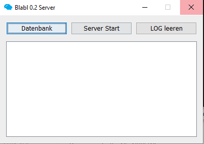
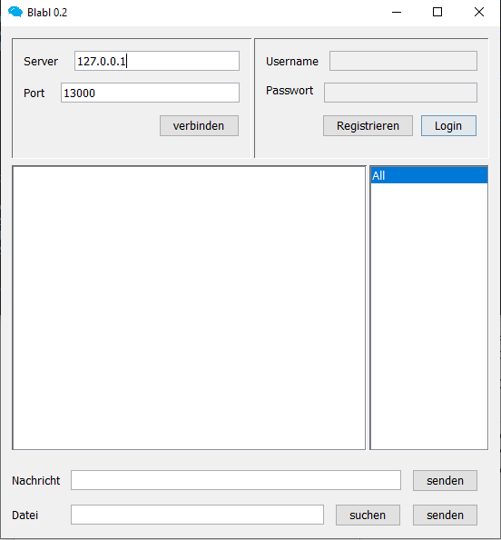

# Blabl (alpha)

Verschlüsselter Instant Messenger mit P2P Filesharing. 

- Algorithmus: RSA
- KeyGen: Blowfish (1024 Bit)
- Cipher: PKCS1Padding

## Server

## Client

## Upcoming

- Presence
- Encrypted Up/Downloads
- End-to-End Encrypted Messages
